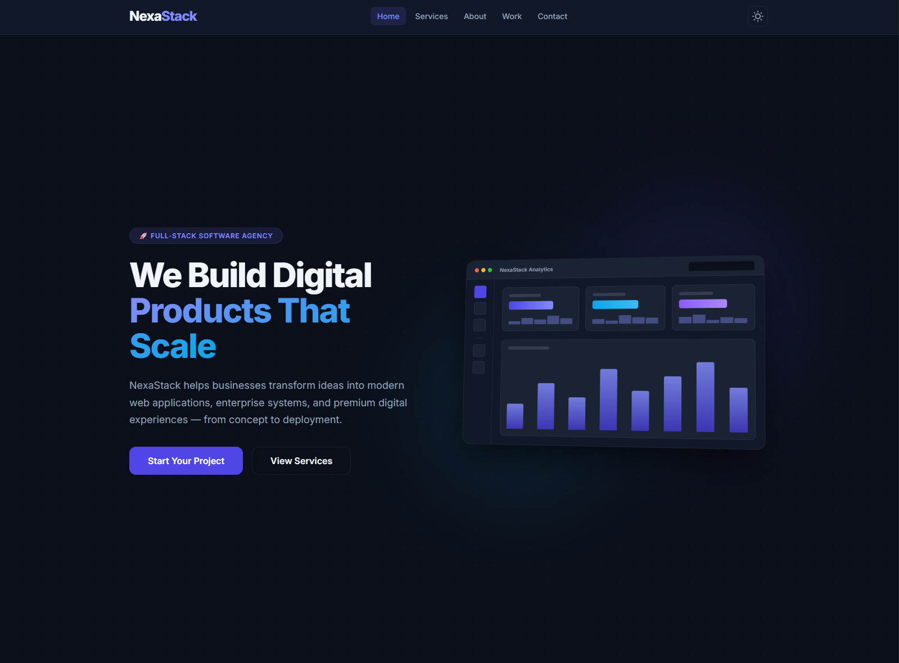
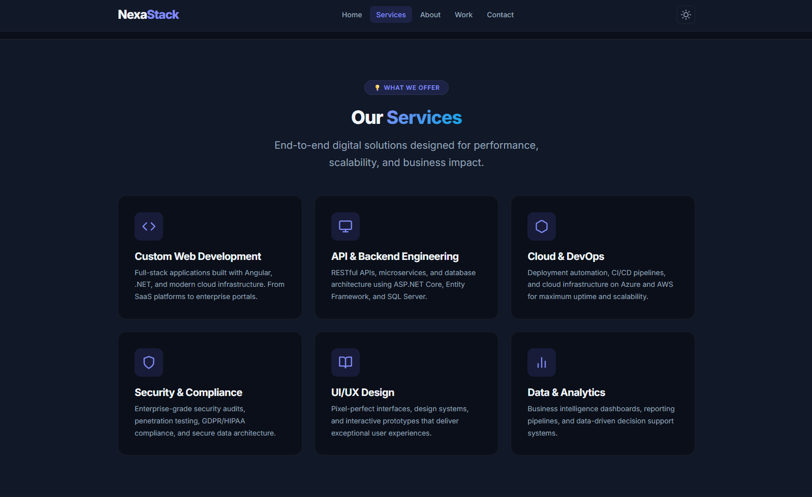
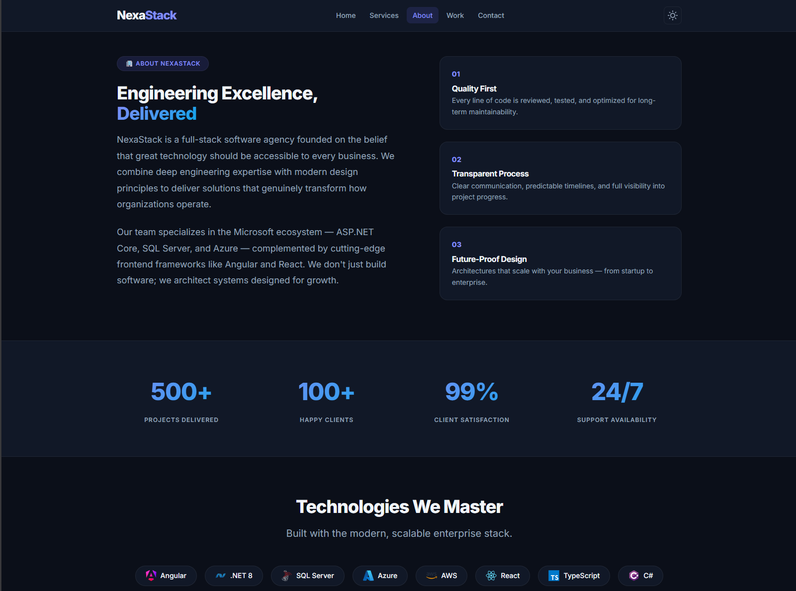
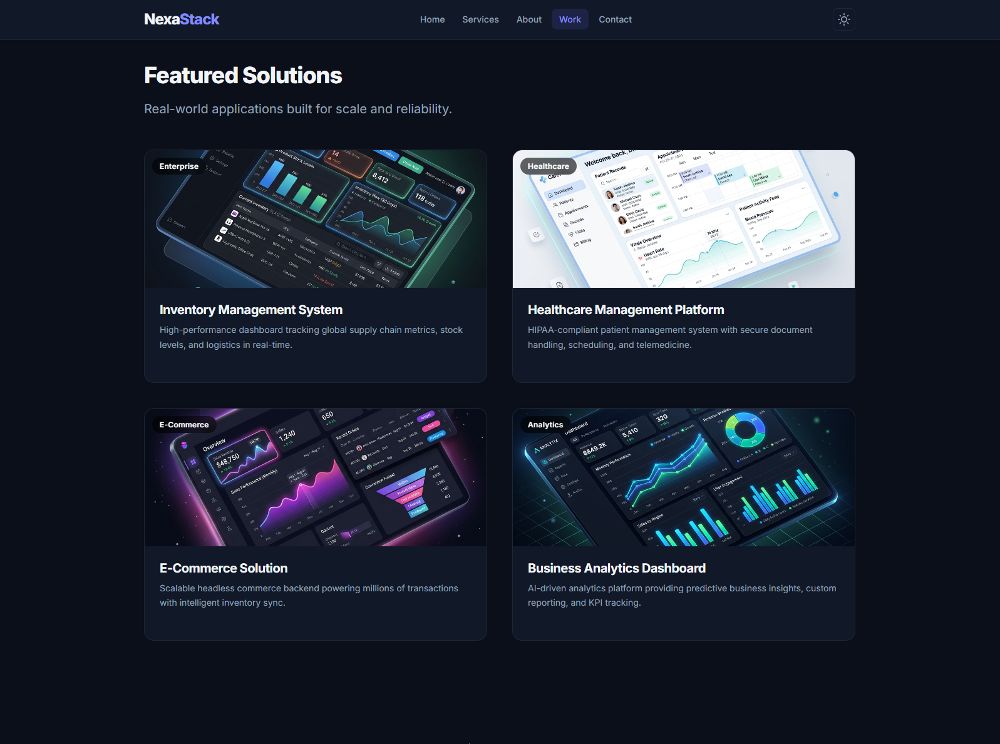
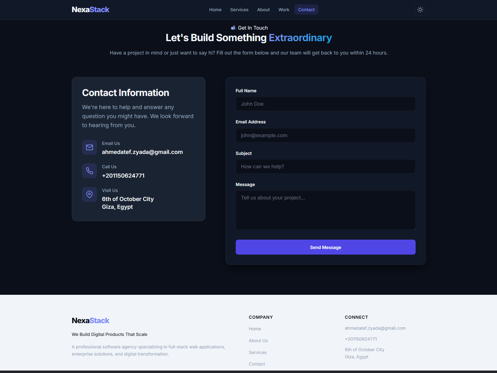
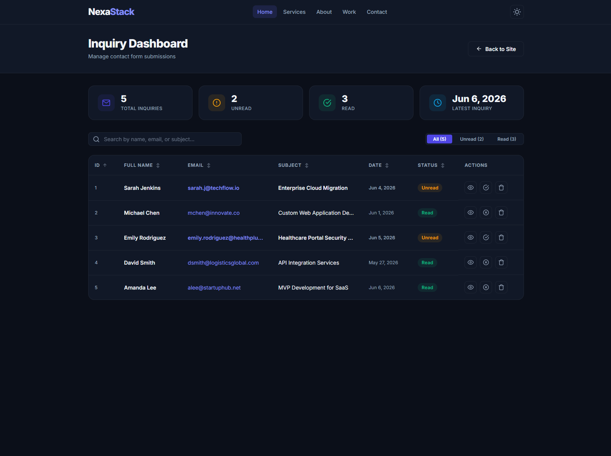
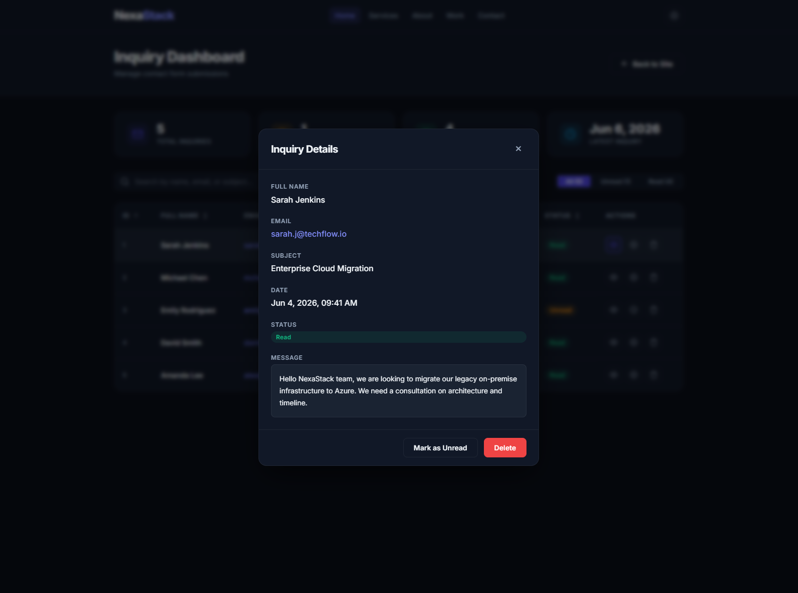

# 🚀 NexaStack — Full-Stack Enterprise Software Agency Platform

<div align="center">


### 🌐 Modern Full-Stack Software Agency Platform

A full-stack software agency platform featuring a modern Angular SPA, ASP.NET Core Web API, administrative inquiry management dashboard, SQL Server persistence, and enterprise-focused security and performance practices.

</div>

---

# ✨ Overview

**NexaStack** is a full-stack software agency platform built using Angular 21, ASP.NET Core 8, Entity Framework Core 8, and SQL Server.

The project simulates a real-world software agency workflow where potential clients can submit inquiries through a professional landing page while administrators manage incoming requests through a dedicated dashboard.

The platform emphasizes:

* Modern Angular Architecture
* Enterprise API Development
* Secure Application Design
* Performance Optimization
* Responsive UI/UX
* Scalable Project Structure
* Professional Development Practices

---

# 🚀 Core Features

## 🌐 Public Agency Website

### Premium Landing Experience

* Fully responsive design
* Dark / Light theme support
* Smooth scrolling navigation
* Service showcase
* Featured solutions showcase
* Agency presentation sections
* Mobile-first experience

### Inquiry Submission System

* Reactive Angular Forms
* Real-time validation
* Backend validation
* SQL Server persistence
* Professional feedback system
* Dynamic rate-limit countdown
* Secure inquiry processing

---

## 📊 Administrative Dashboard

### Inquiry Management

* View all inquiries
* Search inquiries instantly
* Sort inquiries dynamically
* Mark inquiries as read/unread
* Delete inquiries
* Detailed inquiry inspection

### Administrative Productivity

* Localized timestamps
* Responsive dashboard layout
* Optimized rendering
* Fast UI updates
* Enterprise workflow simulation

---

# 🔒 Security & Reliability

The application implements multiple security layers inspired by production-grade systems.

### Security Features

* Global Exception Middleware
* DTO-Based API Contracts
* Input Validation
* Input Sanitization
* SQL Injection Protection via Entity Framework Core
* Structured Error Responses
* Rate Limiting Protection

### Anti-Spam Protection

```text
4 Requests
     ↓
Per Client IP
     ↓
Every 2 Minutes
```

A real-time countdown timer provides immediate feedback whenever limits are exceeded.

---

# ⚡ Performance Optimizations

## Angular Optimizations

* ChangeDetectionStrategy.OnPush
* trackBy Rendering Optimization
* Lazy Loaded Routes
* Reactive State Handling
* Efficient DOM Updates
* Standalone Components

## Backend Optimizations

* DTO-Based Responses
* Optimized Entity Framework Queries
* Lightweight API Payloads
* Efficient Middleware Pipeline
* Global Error Handling

---

# 🏗️ Architecture

```text
Angular SPA
      ↓
REST API
      ↓
ASP.NET Core 8
      ↓
Entity Framework Core 8
      ↓
SQL Server
```

---

# 📂 Project Structure

```text
NexaStack/
│
├── assets/
│   └── screenshots/
│
├── NexaStack.API/
│   ├── Controllers/
│   ├── DTOs/
│   ├── Models/
│   ├── Data/
│   ├── Middleware/
│   ├── Mappings/
│   ├── Migrations/
│   └── Program.cs
│
├── nexastack-client/
│   ├── src/
│   ├── public/
│   ├── package.json
│   └── angular.json
│
└── README.md
```

---

# ⚙️ Technology Stack

| Category        | Technologies                     |
| --------------- | -------------------------------- |
| Frontend        | Angular 21, TypeScript 5.9, RxJS |
| Backend         | ASP.NET Core 8 Web API, C#       |
| Database        | SQL Server                       |
| ORM             | Entity Framework Core 8          |
| Styling         | SCSS                             |
| Forms           | Angular Reactive Forms           |
| Architecture    | SPA + REST API                   |
| Version Control | Git & GitHub                     |

---

# 📊 System Workflows

## 📨 Inquiry Workflow

```text
Visitor Submits Inquiry
            ↓
Angular Validation
            ↓
ASP.NET Core API
            ↓
Entity Framework Core
            ↓
SQL Server Storage
            ↓
Admin Dashboard Updates
```

---

## 🔒 Rate Limiting Workflow

```text
User Sends Requests
            ↓
Rate Limiter Middleware
            ↓
Allowed Request
      OR
429 Too Many Requests
            ↓
Frontend Countdown Timer
```

---

# 📸 Application Preview

## 🌐 Landing Page



---

## 🛠️ Services Section



---

## ℹ️ About Section



---

## 💼 Featured Solutions



---

## 📬 Contact & Inquiry System



---

## 📊 Administrative Dashboard



---

## 🔍 Inquiry Details



---

# 🎯 Engineering Concepts Demonstrated

This project demonstrates:

* Angular Standalone Components
* Lazy Loading
* Reactive Forms
* DTO Architecture
* REST API Design
* Entity Framework Core
* Dependency Injection
* Middleware Pipeline
* Global HTTP Interceptors
* Rate Limiting
* Input Sanitization
* Change Detection Optimization
* Responsive UI Design
* Full-Stack Application Development

---

# ⚙️ Installation

## 1️⃣ Clone Repository

```bash
git clone https://github.com/Ahmed1Atef1/nexastack.git
cd nexastack
```

---

## 2️⃣ Backend Setup

```bash
cd NexaStack.API

dotnet restore

dotnet ef database update

dotnet run
```

---

## 3️⃣ Frontend Setup

```bash
cd nexastack-client

npm install

npm start
```

---

## 4️⃣ Launch Application

Frontend:

```text
http://localhost:4200
```

Backend:

```text
http://localhost:5016
```

---

# 🎓 Key Learning Outcomes

Through this project, the following software engineering concepts were applied in a real-world full-stack environment:

* Enterprise Angular Architecture
* RESTful API Development
* Database Design & ORM Usage
* Backend Security Practices
* Middleware-Based Error Handling
* Client-Side State Management
* Performance Optimization Techniques
* Full-Stack Application Integration

---

# 👨‍💻 Developer

## Ahmed Atef

Business Information Systems (BIS) Student

* GitHub: https://github.com/Ahmed1Atef1
* LinkedIn: https://www.linkedin.com/in/ahmed-atef-15f234/
* Portfolio: https://ahmed-atef-portfolio.vercel.app/

---

<div align="center">

### 🚀 NexaStack — Modern Enterprise Software Agency Platform

Built with Angular 21, ASP.NET Core 8, Entity Framework Core 8 & SQL Server

⭐ If you found the project interesting, consider starring the repository.

</div>
